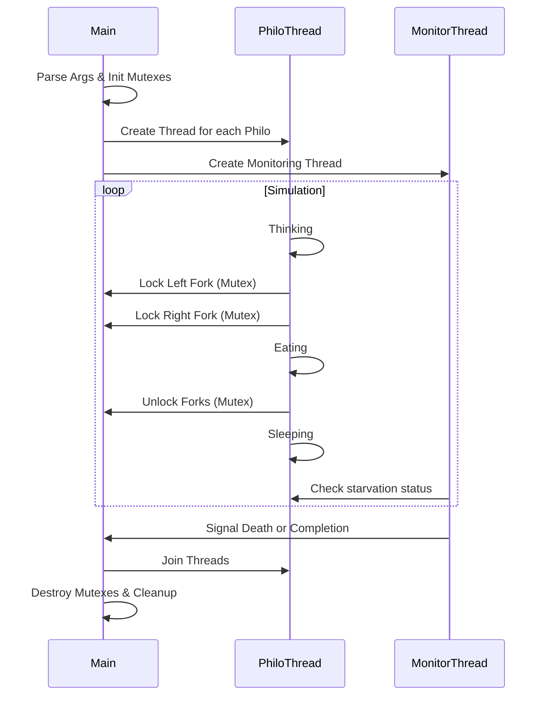
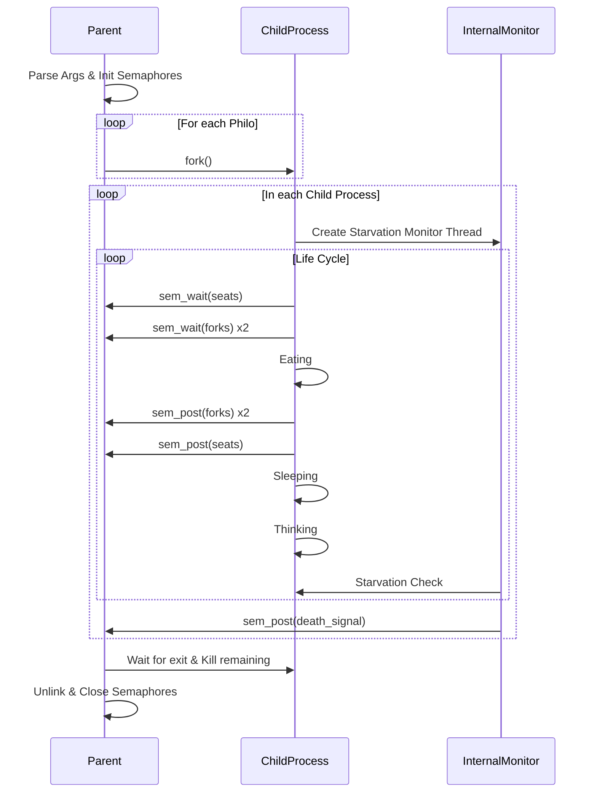

*This project was created as part of the 42 curriculum by rafael-m.*

# Philosophers

## Description
This project is a classic synchronization problem in computer science: the **Dining Philosophers**. It serves as an introduction to concurrent programming, focusing on the management of threads, processes, and shared resources without encountering deadlocks or race conditions.

The objective is to simulate a group of philosophers sitting at a round table, alternating between eating, thinking, and sleeping. To eat, a philosopher needs two forks (one from their left and one from their right). Since the number of forks equals the number of philosophers, they must synchronize their actions to ensure everyone eats and no one starves.

### Key Learning Objectives
- Understanding threads and mutexes (Mandatory part).
- Understanding processes and semaphores (Bonus part).
- Preventing deadlocks and race conditions.
- Precise time management in C.

## Instructions

### Compilation
The project uses a `Makefile` with the following rules:
- `make`: Compiles the mandatory part (`philo`).
- `make bonus`: Compiles the bonus part (`philo_bonus`).
- `make clean`: Removes object files.
- `make fclean`: Removes object files and executables.
- `make re`: Recompiles the project.

### Usage
The executable takes the following arguments:
```bash
./philo <number_of_philosophers> <time_to_die> <time_to_eat> <time_to_sleep> [number_of_times_each_philosopher_must_eat]
```

- `number_of_philosophers`: The number of philosophers and also the number of forks.
- `time_to_die`: (in milliseconds) If a philosopher doesn't start eating `time_to_die` milliseconds after starting their last meal or the beginning of the simulation, they die.
- `time_to_eat`: (in milliseconds) The time it takes for a philosopher to eat. During this time, they will hold two forks.
- `time_to_sleep`: (in milliseconds) The time a philosopher spends sleeping.
- `[number_of_times_each_philosopher_must_eat]`: (Optional) If all philosophers have eaten at least this many times, the simulation stops. If not specified, the simulation stops when a philosopher dies.

**Example:**
```bash
./philo 5 800 200 200
```

## Implementation Details

### Mandatory Part: Threads & Mutexes
The mandatory part focuses on using `pthread` and `mutex` to manage concurrency.

#### Data Structures
- **`t_table`**: Stores the global simulation parameters.
- **`t_mtxs`**: Encapsulates all shared mutexes, including an array of mutexes for forks and a printer mutex for synchronized output.
- **`t_philo`**: Contains individual philosopher data, including their ID, meal count, and pointers to the shared mutexes.

#### Workflow
The simulation follows a multi-threaded approach where each philosopher runs in their own thread.



#### Key Algorithms
- **Fork Assignment Strategy**: Philosophers are assigned forks based on their index. To prevent deadlocks, philosophers pick up their assigned `fork1` and `fork2` in a specific order (e.g., lower index first).
- **Synchronized Startup (Odd/Even Delay)**: To avoid immediate contention for forks, even-numbered philosophers have a small delay (`usleep(1000)`) before starting their cycle. This allows odd-numbered philosophers to pick up forks first.
- **Starvation Monitoring**: A dedicated monitoring thread iterates through all philosophers, checking if the time since their `last_meal_ms` exceeds `time_to_die`. If so, it updates the `dead` flag and stops the simulation.

### Bonus Part: Processes & Semaphores
The bonus part implements the simulation using processes and POSIX semaphores.

#### Data Structures
- **`t_philo`**: Holds the state for a philosopher in a separate process, using semaphores for resource management.
- **Semaphores**: 
    - `forks`: A single semaphore representing the pool of available forks.
    - `printer`: Synchronizes terminal output.
    - `seats`: Limits the number of philosophers trying to eat simultaneously to prevent deadlocks.

#### Workflow
Each philosopher is a separate process created via `fork()`.



#### Key Algorithms
- **The "Seats" Semaphore**: To prevent a deadlock where all philosophers take one fork and wait forever for a second, a `seats` semaphore is initialized with `(n_philos + 1) / 2` (or `n_philos - 1`). Only a limited number of philosophers can attempt to take forks at the same time.
- **Individual Meal Semaphores**: Each philosopher process has its own named semaphore (e.g., `/philo_1`) to protect access to its own `last_meal_ms` timestamp, which is checked by an internal monitoring thread.
- **Process Termination**: When the parent process detects a death (via a child's exit status or a shared semaphore), it kills all remaining child processes using `kill()`.

## Resources

### Documentation & Articles
- [Dining Philosophers Problem - Wikipedia](https://en.wikipedia.org/wiki/Dining_philosophers_problem)
- [Introduction to Threads (pthread)](https://man7.org/linux/man-pages/man7/pthreads.7.html)
- [man]
### AI Usage
AI (Gemini) was utilized during the development of this project for the following tasks:
- **Documentation**: Structuring and generating the `README.md` to comply with project standards.
- **Code Analysis**: Identifying potential edge cases and assisting in debugging synchronization logic.
- **Testing Strategy**: Designing test cases to verify the robustness of the simulation under stress.
