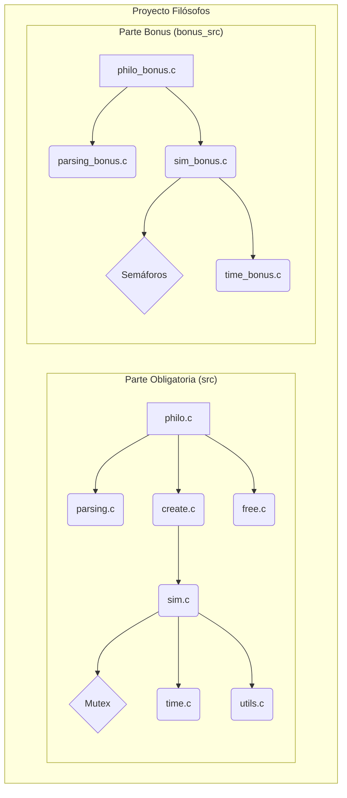
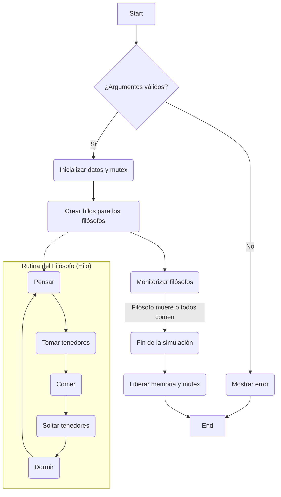
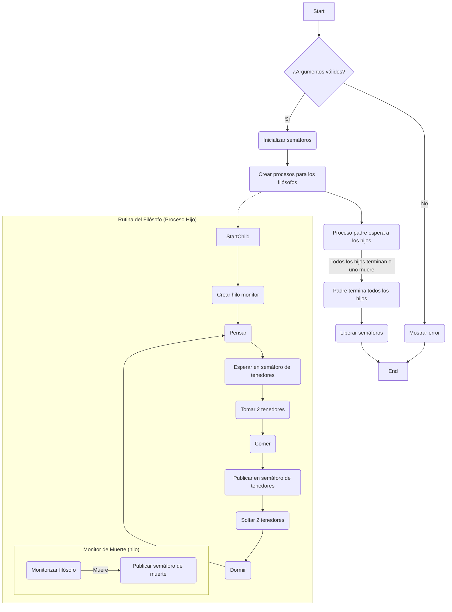

# Philosophers

Este proyecto es una introducción a los problemas de sincronización y concurrencia, utilizando el clásico problema de los filósofos comensales. El objetivo es aprender a manejar hilos (threads) y procesos, y a evitar condiciones de carrera y deadlocks utilizando mutex y semáforos.

## Tecnologías Utilizadas

*   **Lenguaje de Programación:** C
*   **Compilación:** Makefile
*   **Concurrencia (Parte Obligatoria):** Hilos POSIX (pthreads) y Mutex.
*   **Concurrencia (Parte Bonus):** Procesos y Semáforos.

## Arquitectura

El proyecto está dividido en dos partes principales: la parte obligatoria (`src`) y la parte bonus (`bonus_src`). Ambas partes implementan una solución al problema de los filósofos, pero con diferentes mecanismos de concurrencia.

### Estructura de Carpetas y Archivos

*   `src/`: Contiene el código de la parte obligatoria, que utiliza hilos y mutex.
    *   `philo.h`: Fichero de cabecera principal. Define las estructuras de datos (`t_philo`, `t_main`) y los prototipos de las funciones.
    *   `philo.c`: El punto de entrada del programa (`main`). Se encarga de inicializar la simulación.
    *   `parsing.c`: Valida y convierte los argumentos de entrada.
    *   `create.c`: Crea e inicializa las estructuras de los filósofos y los mutex.
    *   `sim.c`: Contiene la lógica principal de la simulación y la rutina que ejecuta cada filósofo.
    *   `sim2.c`: Funciones relacionadas con la muerte de un filósofo y la finalización de la simulación.
    *   `sim3.c`: Funciones auxiliares para la simulación.
    *   `time.c`: Funciones para manejar el tiempo (obtener tiempo actual, dormir).
    *   `utils.c`: Funciones de utilidad (conversión de string a entero, etc).
    *   `free.c`: Libera la memoria y destruye los mutex.
*   `bonus_src/`: Contiene el código de la parte bonus, que utiliza procesos y semáforos.
    *   `philo_bonus.h`: Fichero de cabecera para la parte bonus.
    *   `philo_bonus.c`: Punto de entrada (`main`) para la parte bonus.
    *   Los demás archivos (`parsing_bonus.c`, `sim_bonus.c`, etc.) tienen una funcionalidad análoga a sus contrapartes de la parte obligatoria, pero adaptados para trabajar con procesos y semáforos.
*   `tests/`: Contiene tests unitarios para funciones específicas.
*   `Makefile`: Define las reglas para compilar el proyecto (la parte obligatoria, la parte bonus y las pruebas).

### Diagrama de la Arquitectura

## Flujo del Programa (Parte Obligatoria)

El programa sigue un flujo de ejecución bien definido para gestionar la simulación de los filósofos.

### Diagrama de Flujo

## Flujo del Programa (Parte Bonus)

La parte bonus utiliza procesos en lugar de hilos, y semáforos para la sincronización. El flujo principal es el siguiente:

### Diagrama de Flujo (Bonus)

## Cómo Compilar y Ejecutar

Para compilar el proyecto, utiliza los siguientes comandos:

*   **Parte Obligatoria:** `make`
*   **Parte Bonus:** `make bonus`
*   **Limpiar Bonus:** `make clean_bonus`
*   **Tests:** `make test`

Para ejecutar la simulación, pasa los siguientes argumentos:

`./philo [number_of_philosophers] [time_to_die] [time_to_eat] [time_to_sleep] [number_of_times_each_philosopher_must_eat]`