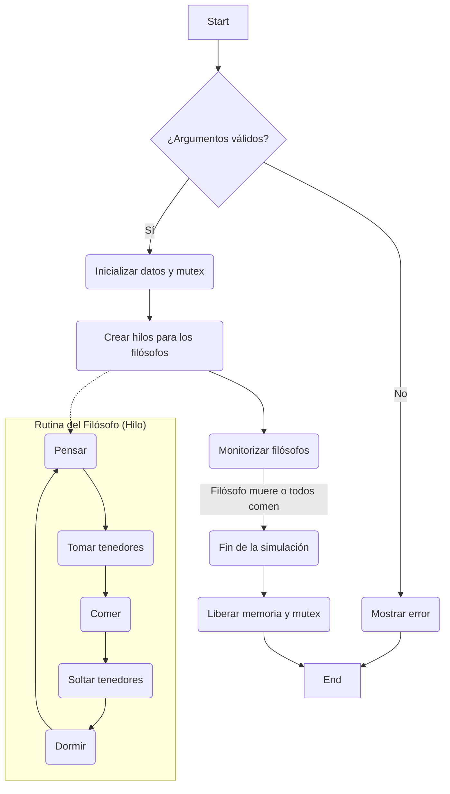

# Philosophers

Este proyecto es una introducción a los problemas de sincronización y concurrencia, utilizando el clásico problema de los filósofos comensales. El objetivo es aprender a manejar hilos (threads) y procesos, y a evitar condiciones de carrera y deadlocks utilizando mutex y semáforos.

## Tecnologías Utilizadas

*   **Lenguaje de Programación:** C
*   **Compilación:** Makefile
*   **Concurrencia (Parte Obligatoria):** Hilos POSIX (pthreads) y Mutex.
*   **Concurrencia (Parte Bonus):** Procesos y Semáforos.

## Compilación y Ejecución

El proyecto cuenta con un `Makefile` robusto que permite compilar diferentes versiones del programa y ejecutar suites de pruebas.

### Comandos de Compilación

*   **Parte Obligatoria (Producción):**
    ```bash
    make
    ```
    Genera el ejecutable `philo` optimizado para la evaluación.

*   **Parte Bonus:**
    ```bash
    make bonus
    ```
    Genera el ejecutable `philo_bonus`.

*   **Versión de Debug (Tester):**
    ```bash
    make tester
    ```
    Genera el ejecutable `tester` con símbolos de depuración (`-g -O0`), utilizado por el suite de pruebas.

*   **Versión ThreadSanitizer (TSan):**
    ```bash
    make philo_tsan
    ```
    Genera el ejecutable `philo_tsan` compilado con `-fsanitize=thread` para detectar condiciones de carrera en tiempo real.

*   **Limpieza:**
    ```bash
    make clean        # Elimina archivos objeto
    make fclean       # Elimina ejecutables y objetos
    make clean_bonus  # Limpia semáforos persistentes (Bonus)
    ```

### Ejecución de la Simulación

Para ejecutar la simulación manualmente:

```bash
./philo number_of_philosophers time_to_die time_to_eat time_to_sleep [number_of_times_each_philosopher_must_eat]
```

Ejemplo:
```bash
./philo 4 410 200 200
```

## Pruebas (Testing)

El proyecto incluye un suite de pruebas integral (`tests/test.sh`) que verifica la corrección lógica, la gestión de memoria y la seguridad de hilos.

### Ejecutar Pruebas

Para ejecutar todas las pruebas automáticamente:

```bash
make tests
```

Este comando realiza lo siguiente:
1.  Compila las versiones necesarias (`tester` y `philo_tsan`).
2.  Ejecuta pruebas unitarias.
3.  Ejecuta pruebas de integración cubriendo:
    *   **Ejecución Normal:** Verifica comportamiento básico (supervivencia, muerte, inputs inválidos).
    *   **Valgrind Memcheck:** Detecta fugas de memoria y accesos inválidos (Timeout 60s).
    *   **Valgrind Helgrind:** Detecta errores de sincronización y deadlocks potenciales (Timeout 10s). Analiza logs incluso si el programa termina por timeout.
    *   **ThreadSanitizer (TSan):** Detecta condiciones de carrera (data races) con alta precisión (Timeout 10s).

### Logs de Pruebas

Los resultados detallados se guardan en directorios específicos dentro de `tests/`:
*   `tests/val_logs/`: Logs de Valgrind Memcheck.
*   `tests/hel_logs/`: Logs de Helgrind.
*   `tests/tsan_logs/`: Logs de ThreadSanitizer.

### Ejecución en Docker

Si estás en un entorno donde Valgrind o TSan no funcionan correctamente (como algunos Linux modernos con seguridad reforzada o macOS), puedes ejecutar las pruebas dentro de un contenedor Docker preparado:

```bash
make docker-run
```
Una vez dentro del contenedor, ejecuta `make tests`.

## Arquitectura

El proyecto está dividido en dos partes principales: la parte obligatoria (`src`) y la parte bonus (`bonus_src`).

### Estructura de Archivos

*   `src/`: Código de la parte obligatoria (Hilos + Mutex).
    *   `philo.c`: Main. Inicialización.
    *   `sim.c`, `sim2.c`, `sim3.c`: Lógica de simulación, rutinas de filósofos, monitorización y chequeo de muerte. **Incluye correcciones para evitar hangs mediante chequeo global de muerte.**
    *   `create.c`: Inicialización de filósofos y mutex.
    *   `time.c`: Gestión de tiempo (`ft_usleep` seguro).
    *   `utils.c`, `parsing.c`, `free.c`: Utilidades, validación y limpieza.
*   `bonus_src/`: Código de la parte bonus (Procesos + Semáforos).
*   `tests/`: Scripts y código fuente de pruebas.

### Diagrama de Flujo (Parte Obligatoria)


