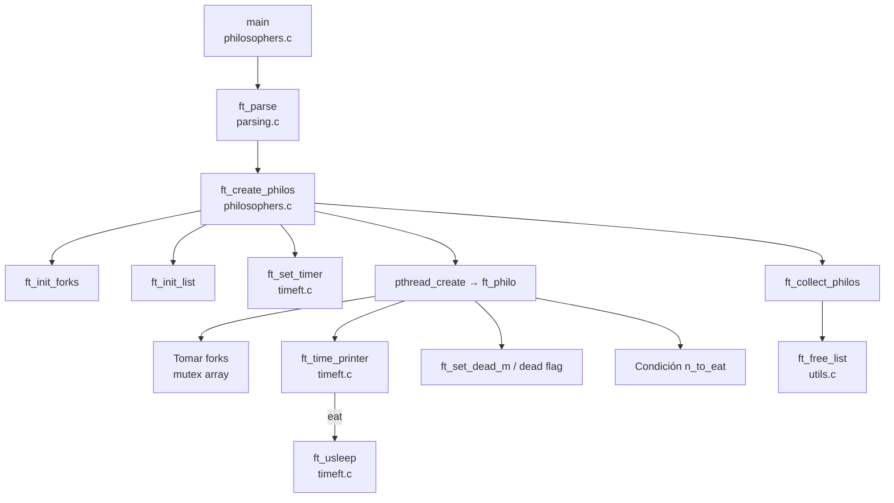

# Informe Arquitectónico – Philosophers

Este documento recoge el análisis arquitectónico del proyecto **Philosophers** (parte obligatoria del curriculum 42). El objetivo es simular el clásico problema de los filósofos cenando garantizando ausencia de _data races_, detección de muertes en tiempo máximo de 10 ms y cumplimiento estricto del formato de logs definido en el subject oficial (`es.subject.pdf`).

## 1. Contexto del subject
- Entrada obligatoria: `number_of_philosophers time_to_die time_to_eat time_to_sleep [number_of_times_each_philosopher_must_eat]`.
- Prohibición de variables globales; sincronización estricta mediante mecanismos proporcionados por POSIX Threads.
- Cada cambio de estado debe registrarse como `timestamp_in_ms X <acción>` respetando orden temporal.
- La simulación se detiene al morir un filósofo o cuando todos han comido el número opcional de veces.
- Cada filósofo debe alternar pensar → tomar tenedores → comer → dormir evitando interbloqueos y starvation.

## 2. Visión arquitectónica
- **Modelo de concurrencia**: `philosophers.c` crea un hilo por filósofo (`pthread_create`) a partir de la lista circular `t_philo`. El hilo principal espera a que cada hilo declare finalización (`ft_collect_philos`).
- **Estructuras de dominio**:
  - `t_arg` (`philosophers.h`) encapsula parámetros iniciales.
  - `t_philo` (`philosophers.h`) representa cada filósofo como nodo de una lista circular enlazada que comparte punteros a recursos comunes (forks, mutex de impresión, bandera de terminación).
- **Sincronización**:
  - Un array de `pthread_mutex_t` (`ft_init_forks`) modela los tenedores. La política de adquisición alterna el orden según paridad del filósofo para mitigar deadlocks.
  - `printer` serializa la salida para mantener logs coherentes.
  - `dead_m` + `dead` constituyen el mecanismo de parada segura para todos los hilos.
- **Gestión temporal**: `timeft.c` expone `ft_get_time`, `ft_usleep` y `ft_time_printer` para operar en milisegundos, dormir con comprobaciones periódicas y cortar el ciclo si se excede `time_to_die`.
- **Ciclo de vida**:
  1. `main` valida argumentos (`ft_parse` en `parsing.c`) y reserva memoria.
  2. `ft_create_philos` inicializa forks, lista circular y mutexes, sincroniza timers (`ft_set_timer`) y lanza los hilos de filósofos.
  3. Cada hilo ejecuta `ft_philo`: toma forks, come, duerme, piensa y repite hasta morir o completar `n_to_eat`.
  4. El hilo principal consolida terminación (`ft_collect_philos`), libera memoria (`ft_free_list` en `utils.c`) y destruye recursos.
- **Gestión de memoria**: todas las reservas usan `ft_calloc` (propio) y la liberación se concentra en `ft_free_list`, asegurando ausencia de leaks acorde al subject.

## 3. Tecnologías y herramientas
- Lenguaje C estándar (C99) con compilación vía `cc`.
- Biblioteca POSIX Threads (`pthread_create`, `pthread_join`, `pthread_mutex_*`).
- API POSIX para medición temporal: `gettimeofday`, `usleep`.
- `Makefile` con flags `-g -O1 -pthread` y reglas `all`, `clean`, `fclean`.
- Script de verificación `test_philo.sh` (Bash) que usa `timeout`, `grep` y comprobaciones personalizadas.

## 4. Mapa de componentes
```
.
├── Makefile
├── philosophers.h          # Definición de estructuras, constantes y prototipos
├── philosophers.c          # Orquestación principal, creación de hilos y sincronización
├── parsing.c               # Validación de argumentos y conversión segura a enteros
├── timeft.c                # Utilidades de tiempo y control de impresión
├── utils.c                 # utilidades (calloc, strlen, liberación de lista, flag de parada)
├── test_philo.sh           # Suite de pruebas funcionales y de validación de logs
├── main.c                  # Stub experimental no incluido en la build
├── es.subject.pdf          # Enunciado oficial (versión en español)
└── *.txt / log.txt         # Archivos temporales o de pruebas manuales
```

## 5. Flujo de ejecución (Mermaid)


## 6. Consideraciones operativas
- **Log coherente**: `ft_time_printer` controla la ventana crítica de impresión y actualiza `last_meal_t` antes de liberar los mutex.
- **Single philosopher**: `ft_one_philo` maneja el caso límite (único tenedor) para cumplir tiempos de muerte.
- **Pruebas recomendadas**: ejecutar `./test_philo.sh` tras compilar para validar argumentos, monotonicidad de timestamps y cumplimiento del formato.

## 7. Próximos pasos sugeridos
- Activar y estabilizar flags de diagnóstico (`-Wall -Wextra -Werror` y sanitizadores) en el `Makefile`.
- Incluir tests de integridad adicionales (p.ej. escenarios de alta contención) y mediciones de tiempo crítico para asegurar margen frente al límite de 10 ms.
