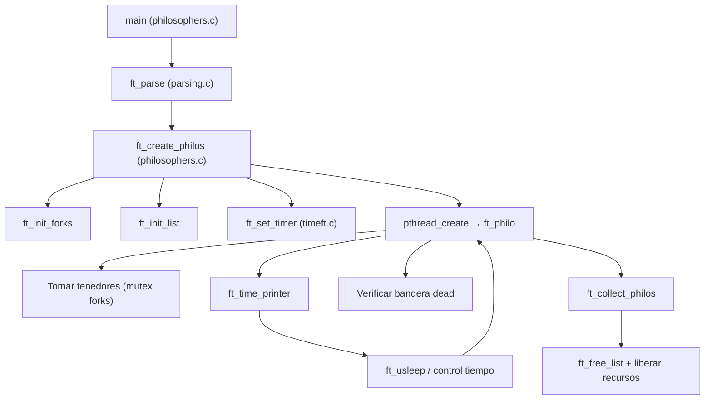

# Informe de Arquitectura – Philosophers

## Resumen del enunciado
- Simular el problema de los filósofos cenando utilizando hilos y mutex según el subject oficial de 42.
- Entrada: `number_of_philosophers time_to_die time_to_eat time_to_sleep [number_of_times_each_philosopher_must_eat]`.
- Cada filósofo debe alternar acciones (pensar, coger tenedores, comer, dormir) sin condiciones de carrera y detectando muertes.
- La versión entregada es la parte obligatoria basada en hilos (no incluye `philo_bonus` con procesos/semáforos).

## Arquitectura técnica
- **Modelo de concurrencia**: se crea un hilo por filósofo (`pthread_create`) y se gestiona con un bucle principal que coordina su finalización (`ft_collect_philos`).
- **Estructuras de datos**:
  - `t_arg` encapsula la configuración de la simulación (número de filósofos, tiempos y límite opcional de comidas).
  - `t_philo` representa a cada filósofo como un nodo de una lista circular enlazada, compartiendo punteros a recursos comunes (array de mutex de tenedores, mutex de impresión y bandera de muerte).
- **Coordinación**:
  - Un array de `pthread_mutex_t` representa los tenedores. El acceso se ordena alternando qué tenedor se toma primero según el índice del filósofo para evitar interbloqueos.
  - Un mutex adicional (`printer`) serializa la salida por pantalla y controla el aviso de muerte.
  - Un mutex (`dead_m`) y una bandera compartida determinan cuándo finalizar la simulación o cuándo un filósofo termina su ciclo de comidas.
- **Gestión del tiempo**:
  - `ft_get_time` y `ft_usleep` envuelven `gettimeofday` y `usleep` para trabajar en milisegundos y despertar periódicamente a los hilos para comprobar estados.
  - `ft_time_printer` centraliza la lógica de registro de acciones, actualiza `last_meal_t` y gestiona el corte cuando un filósofo muere.
- **Ciclo de vida**:
  1. `main` valida argumentos (`ft_parse`) y delega en `ft_create_philos`.
  2. Se inicializan los mutex de los tenedores (`ft_init_forks`) y la lista circular de filósofos (`ft_init_list`), compartiendo la configuración y recursos comunes.
  3. Se inicializan los temporizadores (`ft_set_timer`) y se lanzan los hilos. Cada hilo ejecuta `ft_philo`, que controla el bucle de acciones hasta morir o completar las comidas requeridas.
  4. El hilo principal espera a que cada hilo finalice (`ft_collect_philos`) y libera memoria (`ft_free_list`).

## Tecnologías utilizadas
- Lenguaje C estándar compilado con `cc` (GNU Compiler Collection por defecto).
- Biblioteca POSIX Threads (`pthread_create`, `pthread_join`, mutex de pthread).
- Syscalls/funciones POSIX: `gettimeofday`, `usleep`, `write`.
- Herramientas de compilación: `Makefile` con flags `-g -O1 -pthread`.
- Scripts auxiliares en Bash (`test_philo.sh`) que utilizan `timeout`, `grep`, `printf`.

## Estructura de carpetas y archivos
- `Makefile`: orquesta la compilación del binario `philo` a partir de los módulos fuente.
- `philosophers.c`: punto de entrada real; inicializa estructuras, crea hilos y orquesta la simulación.
- `philosophers.h`: definiciones de estructuras, macros y prototipos compartidos.
- `parsing.c`: validación y conversión segura de argumentos de línea de comandos.
- `timeft.c`: utilidades de tiempo y sincronización de acciones.
- `utils.c`: utilidades generales (calloc propio, liberación de lista circular, helpers).
- `test_philo.sh`: suite de pruebas automatizadas en Bash para validar argumentos y comportamiento básico.
- `main.c`: stub de pruebas no referenciado por el `Makefile` (no participa en la build principal).
- `es.subject.pdf`: enunciado oficial (versión en español) utilizado como referencia.
- `philo`: binario resultante tras compilar.
