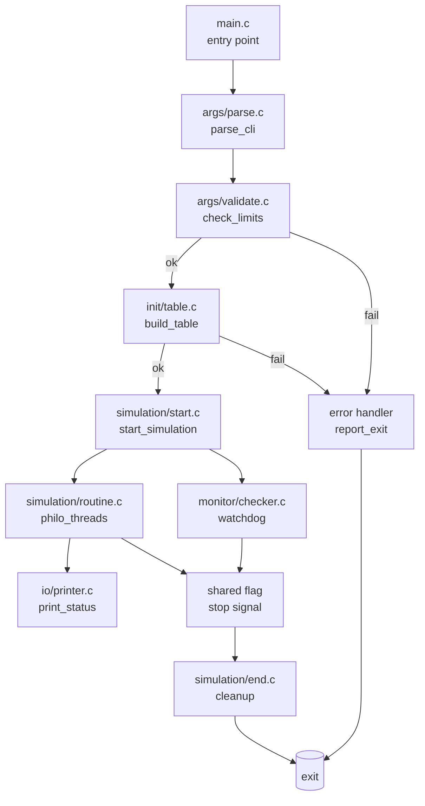

# Suggested Program Structure

```mermaid
graph TD
    Main[main.c<br/>entry point]
    Parse[args/parse.c<br/>parse_cli]
    Validate[args/validate.c<br/>check_limits]
    Init[init/table.c<br/>build_table]
    StartSim[simulation/start.c<br/>start_simulation]
    Spawn[simulation/routine.c<br/>philo_threads]
    Monitor[monitor/checker.c<br/>watchdog]
    Printer[io/printer.c<br/>print_status]
    Signal[shared flag<br/>stop signal]
    Join[simulation/end.c<br/>cleanup]
    Error[error handler<br/>report_exit]
    Exit[(exit)]

    Main --> Parse
    Parse --> Validate
    Validate -->|ok| Init
    Validate -->|fail| Error
    Init -->|ok| StartSim
    Init -->|fail| Error
    StartSim --> Spawn
    StartSim --> Monitor
    Spawn --> Printer
    Spawn --> Signal
    Monitor --> Signal
    Signal --> Join
    Join --> Exit
    Error --> Exit
```
